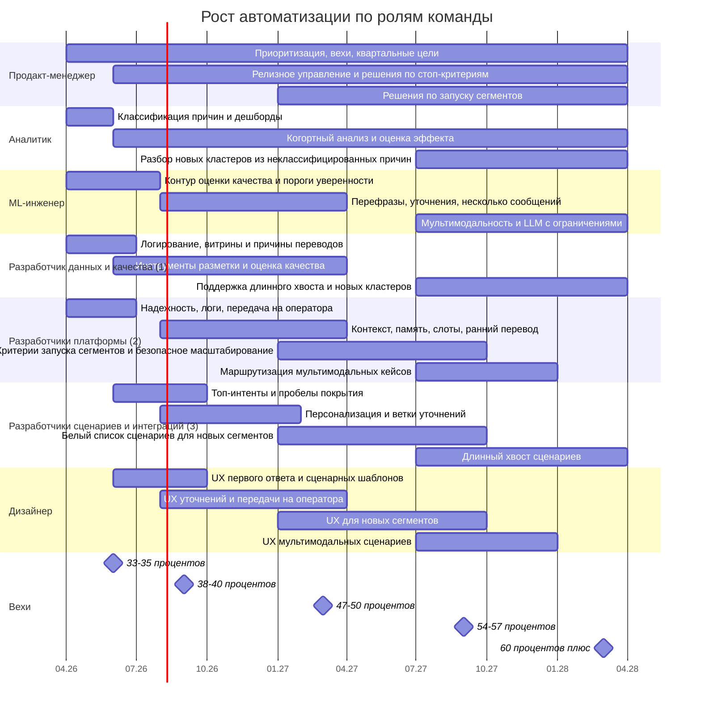

# Диаграмма Ганта по ролям команды

[← К общей дорожной карте](support-automation-roadmap-visual.html)

Ось — месяцы и даты от старта программы (`апрель 2026`); длительности заданы в месяцах.

## Диаграмма

### Легенда по распределению команды

| Роль | Зона ответственности |
|---|---|
| Продакт-менеджер | Приоритизация, последовательность запуска, контроль метрик, решения по стоп-критериям и масштабированию |
| Аналитик | Классификация причин переводов, когорты, оценка эффекта, дешборды |
| ML-инженер | Порог уверенности, NLU-улучшения, мультимодальность, LLM-ограничения |
| 1 разработчик в потоке данных и качества | События, витрины, инструменты разметки, инструменты контроля качества |
| 2 разработчика платформы | Надежность, память, слоты, передача на оператора, критерии запуска сегментов |
| 3 разработчика сценариев и интеграций | Топ-интенты, новые ветки, персонализация, сегментные сценарии |
| Дизайнер | UX первого ответа, уточнений, передачи на оператора и новых сегментов |

Продакт-менеджер показан как владелец программы, но не входит в указанную численность `6 разработчиков, 1 ML-инженер, 1 аналитик, 1 дизайнер`.
