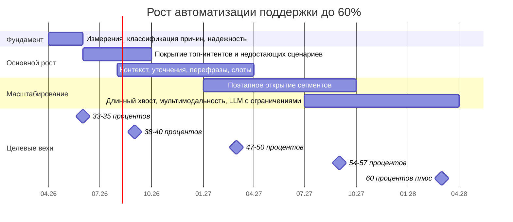

# Визуализация дорожной карты роста автоматизации

Ниже дорожная карта в наглядном виде при старте программы в `апреле 2026`. На диаграммах Ганта ось — месяцы и даты; длительности фаз заданы в месяцах от старта.

## Таймлайн по фазам

## Что дает каждая фаза

| Фаза | Период | Главный результат | Ожидаемый вклад |
|---|---|---|---|
| 1 | 0-2 месяца | Убрали слепую зону, починили надежность, сделали качественную передачу на оператора | Фундамент без заметного прямого роста |
| 2 | 2-6 месяцев | Закрыли самые емкие пробелы в сценариях | `+6-8 п.п.` |
| 3 | 4-12 месяцев | Бот начал помнить контекст и лучше понимать уточнения | `+8-10 п.п.` |
| 4 | 9-18 месяцев | Аккуратно открыли новые сегменты без просадки качества | `+5-7 п.п.` |
| 5 | 15-24 месяцев | Добрали длинный хвост и мультимодальные кейсы | `+3-6 п.п.` |

## Как читать схему

- На блоке **Таймлайн по фазам** видно, как во времени лежат фундамент, основной рост и масштабирование и где стоят целевые вехи по доле автоматизации.
- Таблица **Что дает каждая фаза** связывает номер фазы с периодом, результатом и ожидаемым вкладом в процентные пункты.
- Отдельная страница: **[диаграмма Ганта по ролям команды](gantt-roles.html)** — там зоны ответственности и легенда; более рискованные темы (VIP, LLM, длинный хвост) на диаграмме смещены к более поздним отрезкам после роста качества.
